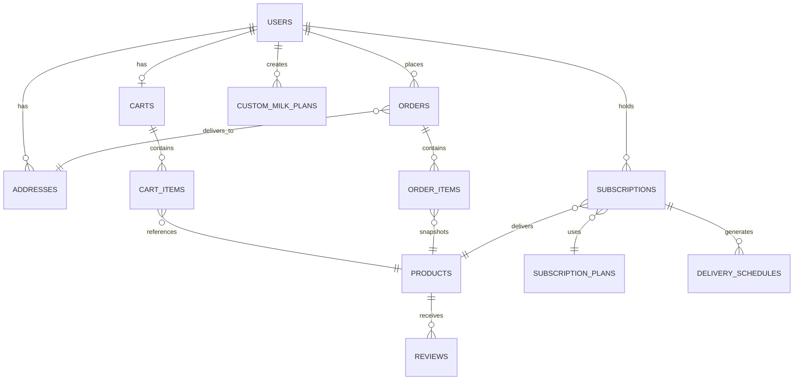

# Pura — Backend Documentation Pack (Part 2 of 4)
## Entity Relationships · API Routes · Frontend Mapping · Request/Response Examples

---

# 6. Entity Relationship Explanation

- **One User** has **one Cart** (1:1). Cart is created on first add-to-cart.
- **One User** has **many Addresses** (1:N). One address can be marked `is_default`.
- **One User** has **many Orders** (1:N). Each order snapshots the delivery address.
- **One User** has **many Subscriptions** (1:N). Each subscription ties to one Plan and one Product.
- **One User** has **many Custom Milk Plans** (1:N). Each is a saved configuration.
- **One Cart** has **many CartItems** (1:N). Each CartItem references one Product.
- **One Order** has **many OrderItems** (1:N). OrderItems snapshot product name and price at order time.
- **One Order** references **one Address** (N:1). Address used for delivery.
- **One Subscription** belongs to **one SubscriptionPlan** (N:1) and **one Product** (N:1).
- **One Subscription** has **many DeliverySchedules** (1:N). Generated automatically.
- **One Product** has **many Reviews** (1:N).



---

# 7. Full API Route Documentation

## 7.1 Auth APIs

| Method | Path | Purpose | Auth? | Request Body | Response |
|---|---|---|---|---|---|
| POST | `/api/auth/signup` | Register new user | No | `{email, password, fullName, phone}` | `{token, user}` |
| POST | `/api/auth/login` | Login | No | `{email, password}` | `{token, refreshToken, user}` |
| POST | `/api/auth/refresh` | Refresh JWT | No | `{refreshToken}` | `{token}` |
| POST | `/api/auth/logout` | Invalidate token | Yes | — | `204 No Content` |

## 7.2 Product APIs

| Method | Path | Purpose | Auth? | Params | Response |
|---|---|---|---|---|---|
| GET | `/api/products` | List/filter products | No | `?category=&milkType=&search=&subscriptionOnly=&page=&size=` | Paginated product list |
| GET | `/api/products/featured` | Featured products for landing | No | — | Array of 4 products |
| GET | `/api/products/{id}` | Single product detail | No | — | Full product object |
| GET | `/api/products/{id}/related` | Related products | No | `?limit=4` | Array of products |
| GET | `/api/products/{id}/reviews` | Product reviews | No | `?page=&size=` | Paginated reviews |
| POST | `/api/products` | Create product (admin) | Yes (ADMIN) | Product body | Created product |
| PUT | `/api/products/{id}` | Update product (admin) | Yes (ADMIN) | Product body | Updated product |

## 7.3 Cart APIs

| Method | Path | Purpose | Auth? | Request Body | Response |
|---|---|---|---|---|---|
| GET | `/api/cart` | Get user's cart | Yes | — | Cart with items and totals |
| POST | `/api/cart/items` | Add item to cart | Yes | `{productId, quantity, isSubscription}` | Updated cart |
| PUT | `/api/cart/items/{itemId}` | Update quantity | Yes | `{quantity}` | Updated cart |
| DELETE | `/api/cart/items/{itemId}` | Remove item | Yes | — | Updated cart |
| DELETE | `/api/cart` | Clear cart | Yes | — | `204 No Content` |

## 7.4 Order APIs

| Method | Path | Purpose | Auth? | Request Body | Response |
|---|---|---|---|---|---|
| POST | `/api/orders` | Place order from cart | Yes | `{addressId, paymentMethod, deliveryTime}` | Order confirmation |
| GET | `/api/orders` | List user's orders | Yes | `?page=&size=` | Paginated orders |
| GET | `/api/orders/{id}` | Order detail | Yes | — | Full order with items |

## 7.5 Subscription APIs

| Method | Path | Purpose | Auth? | Request Body | Response |
|---|---|---|---|---|---|
| GET | `/api/subscription-plans` | List available plans | No | — | Array of plans |
| POST | `/api/subscriptions` | Create subscription | Yes | `{planId, productId, quantityLitres, deliveryTime, customDays}` | Subscription object |
| GET | `/api/subscriptions` | List user's subscriptions | Yes | — | Array |
| GET | `/api/subscriptions/{id}` | Subscription detail | Yes | — | Subscription with schedules |
| PUT | `/api/subscriptions/{id}/pause` | Pause subscription | Yes | — | Updated subscription |
| PUT | `/api/subscriptions/{id}/resume` | Resume subscription | Yes | — | Updated subscription |
| DELETE | `/api/subscriptions/{id}` | Cancel subscription | Yes | — | `204 No Content` |

## 7.6 Custom Milk Plan APIs

| Method | Path | Purpose | Auth? | Request Body | Response |
|---|---|---|---|---|---|
| POST | `/api/custom-milk-plans` | Save custom plan | Yes | `{milkType, fatProfile, fatPercentage, quantityLitres, deliveryFrequency, deliveryTime, customDays}` | Saved plan |
| GET | `/api/custom-milk-plans` | List user's plans | Yes | — | Array |

## 7.7 User / Address APIs

| Method | Path | Purpose | Auth? | Request Body | Response |
|---|---|---|---|---|---|
| GET | `/api/users/profile` | Get profile | Yes | — | User object |
| PUT | `/api/users/profile` | Update profile | Yes | `{fullName, phone}` | Updated user |
| GET | `/api/users/addresses` | List addresses | Yes | — | Array |
| POST | `/api/users/addresses` | Add address | Yes | Address body | Created address |
| PUT | `/api/users/addresses/{id}` | Update address | Yes | Address body | Updated address |
| DELETE | `/api/users/addresses/{id}` | Delete address | Yes | — | `204` |

## 7.8 Dashboard APIs

| Method | Path | Purpose | Auth? | Request Body | Response |
|---|---|---|---|---|---|
| GET | `/api/dashboard/summary` | Overview stats | Yes | — | `{deliveriesThisMonth, spentThisMonth, activeSubscription, nextDelivery}` |
| GET | `/api/dashboard/upcoming-deliveries` | Next deliveries | Yes | `?limit=5` | Array of delivery schedules |

## 7.9 Misc APIs

| Method | Path | Purpose | Auth? |
|---|---|---|---|
| POST | `/api/coupons/validate` | Validate coupon code | Yes |

---

# 8. Frontend-to-Backend Mapping Table

| Frontend Page | User Action | Backend API | Entities | Auth? |
|---|---|---|---|---|
| `/` (Landing) | Page load | `GET /api/products/featured` (optional) | Product | No |
| `/shop` | Page load | `GET /api/products` | Product | No |
| `/shop` | Filter/search | `GET /api/products?category=&milkType=&search=` | Product | No |
| `/product/[id]` | Page load | `GET /api/products/{id}` | Product | No |
| `/product/[id]` | Scroll to reviews | `GET /api/products/{id}/reviews` | Review | No |
| `/product/[id]` | Related section | `GET /api/products/{id}/related` | Product | No |
| `/product/[id]` | "Add to Cart" click | `POST /api/cart/items` | Cart, CartItem | Yes |
| `/custom` | Step 4 "Add to Cart" | `POST /api/custom-milk-plans` then `POST /api/cart/items` | CustomMilkPlan, CartItem | Yes |
| `/subscribe` | Page load | `GET /api/subscription-plans` | SubscriptionPlan | No |
| `/subscribe` | "Start plan" click | `POST /api/subscriptions` | Subscription | Yes |
| `/cart` | Page load | `GET /api/cart` | Cart, CartItem | Yes |
| `/cart` | Update quantity | `PUT /api/cart/items/{id}` | CartItem | Yes |
| `/cart` | Remove item | `DELETE /api/cart/items/{id}` | CartItem | Yes |
| `/cart` | Apply coupon | `POST /api/coupons/validate` | — | Yes |
| `/cart` | Continue to Delivery | Frontend navigation (no API) | — | — |
| `/cart` | Submit delivery form | `POST /api/users/addresses` (if new) | Address | Yes |
| `/cart` | Confirm order | `POST /api/orders` | Order, OrderItem | Yes |
| `/dashboard` Overview | Page load | `GET /api/dashboard/summary`, `GET /api/dashboard/upcoming-deliveries` | Multiple | Yes |
| `/dashboard` Subscriptions | Tab click | `GET /api/subscriptions` | Subscription | Yes |
| `/dashboard` Subscriptions | Pause / Resume | `PUT /api/subscriptions/{id}/pause` or `/resume` | Subscription | Yes |
| `/dashboard` Orders | Tab click | `GET /api/orders` | Order | Yes |
| `/dashboard` Settings | Tab click | `GET /api/users/profile` | User | Yes |
| `/dashboard` Settings | Save changes | `PUT /api/users/profile` | User | Yes |
| `/advisor` | Send message | `POST /api/advisor` (existing Next.js route) | — | Optional |

---

# 9. Request / Response Examples

## 9.1 Product List Response
```json
// GET /api/products?category=fresh-milk&page=0&size=10
{
  "content": [
    {
      "id": "a2-cow-milk-1l",
      "name": "A2 Cow Milk",
      "shortName": "A2 Cow Milk",
      "category": "fresh-milk",
      "milkType": "cow",
      "fatPercentage": 3.5,
      "fatProfile": "balanced",
      "pricePerUnit": 65,
      "priceUnit": "/L",
      "isSubscriptionEligible": true,
      "badgeLabel": "A2 Certified",
      "description": "Sourced from certified Gir and Sahiwal cows...",
      "rating": 4.9,
      "reviewCount": 2847,
      "inStock": true
    }
  ],
  "totalElements": 8,
  "totalPages": 1,
  "number": 0,
  "size": 10
}
```

## 9.2 Single Product Detail Response
```json
// GET /api/products/a2-cow-milk-1l
{
  "id": "a2-cow-milk-1l",
  "name": "A2 Cow Milk",
  "shortName": "A2 Cow Milk",
  "category": "fresh-milk",
  "milkType": "cow",
  "fatPercentage": 3.5,
  "fatProfile": "balanced",
  "pricePerUnit": 65,
  "priceUnit": "/L",
  "quantity": 1,
  "quantityUnit": "L",
  "availableQuantities": [0.5, 1, 1.5, 2],
  "isSubscriptionEligible": true,
  "badgeLabel": "A2 Certified",
  "description": "Sourced from certified Gir and Sahiwal cows...",
  "benefits": ["A2 beta-casein protein only", "Easier on digestion", "No added hormones", "Delivered within 6 hours"],
  "farmSource": "Anand Cooperative Farms, Gujarat",
  "deliveryNote": "Delivered fresh before 7 AM daily",
  "nutritionFacts": [
    {"label": "Fat", "value": "3.5", "unit": "%"},
    {"label": "Protein", "value": "3.2", "unit": "g/100ml"}
  ],
  "rating": 4.9,
  "reviewCount": 2847,
  "inStock": true
}
```

## 9.3 Add to Cart
```json
// POST /api/cart/items
// Request:
{ "productId": "a2-cow-milk-1l", "quantity": 2, "isSubscription": true }

// Response (updated cart):
{
  "id": 1,
  "items": [
    {
      "id": 101,
      "productId": "a2-cow-milk-1l",
      "productName": "A2 Cow Milk",
      "pricePerUnit": 65,
      "quantity": 2,
      "isSubscription": true,
      "lineTotal": 130
    }
  ],
  "subtotal": 130,
  "deliveryFee": 0,
  "total": 130
}
```

## 9.4 Create Order
```json
// POST /api/orders
// Request:
{ "addressId": 5, "paymentMethod": "upi", "deliveryTime": "morning" }

// Response:
{
  "id": 42,
  "orderNumber": "ORD-8822",
  "status": "PLACED",
  "paymentStatus": "PENDING",
  "subtotal": 190,
  "deliveryFee": 0,
  "total": 190,
  "items": [
    { "productName": "A2 Cow Milk", "quantity": 2, "unitPrice": 65, "isSubscription": true },
    { "productName": "Farm Fresh Curd", "quantity": 1, "unitPrice": 60, "isSubscription": false }
  ],
  "placedAt": "2025-03-12T10:15:30Z"
}
```

## 9.5 Create Subscription
```json
// POST /api/subscriptions
// Request:
{
  "planId": "daily",
  "productId": "a2-cow-milk-1l",
  "quantityLitres": 1,
  "deliveryTime": "morning",
  "customDays": null
}

// Response:
{
  "id": 7,
  "planName": "Daily",
  "productName": "A2 Cow Milk",
  "quantityLitres": 1.0,
  "deliveryTime": "morning",
  "status": "ACTIVE",
  "pricePerDay": 65,
  "pricePerMonth": 1950,
  "startedAt": "2025-03-12T10:20:00Z"
}
```

## 9.6 Dashboard Summary
```json
// GET /api/dashboard/summary
{
  "deliveriesThisMonth": 31,
  "spentThisMonth": 2015,
  "activeSubscriptionCount": 1,
  "nextDelivery": {
    "date": "2025-03-13",
    "time": "Before 7 AM",
    "items": ["A2 Cow Milk — 1L", "Farm Fresh Curd — 500g"],
    "status": "CONFIRMED"
  }
}
```

## 9.7 Save Custom Milk Plan
```json
// POST /api/custom-milk-plans
// Request:
{
  "milkType": "cow",
  "fatProfile": "balanced",
  "fatPercentage": 3.5,
  "quantityLitres": 1.5,
  "deliveryFrequency": "alternate",
  "deliveryTime": "morning",
  "customDays": null
}

// Response:
{
  "id": 12,
  "milkType": "cow",
  "fatProfile": "balanced",
  "fatPercentage": 3.5,
  "quantityLitres": 1.5,
  "deliveryFrequency": "alternate",
  "deliveryTime": "morning",
  "pricePerDelivery": 98,
  "createdAt": "2025-03-12T10:25:00Z"
}
```

## 9.8 Auth Login
```json
// POST /api/auth/login
// Request:
{ "email": "arjun@example.com", "password": "securepassword123" }

// Response:
{
  "token": "eyJhbGciOiJIUzI1NiIs...",
  "refreshToken": "dGhpcyBpcyBhIHJlZnJl...",
  "user": {
    "id": 1,
    "email": "arjun@example.com",
    "fullName": "Arjun Mehta",
    "phone": "+919876543210",
    "role": "USER"
  }
}
```

---

> **Continue to Part 3 →** Auth Plan, Validation, Business Logic, Error Handling, API Response Standards
